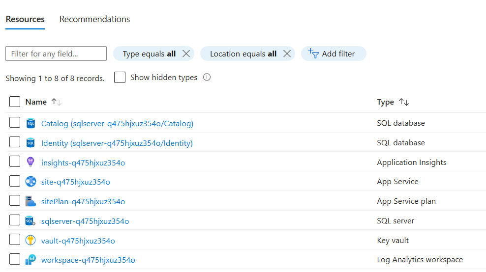

[comment]: <> (please keep all comment items at the top of the markdown file)
[comment]: <> (please do not change the ***, as well as 
 placeholders for Note and Tip layout)
[comment]: <> (please keep the ### 1. and 2. titles as is for consistency across all demoguides)
[comment]: <> (section 1 provides a bullet list of resources + clarifying screenshots of the key resources details)
[comment]: <> (section 2 provides summarized step-by-step instructions on what to demo)

[comment]: <> (this is the section for the Note: item; please do not make any changes here)
***
### Azure PaaS with EShopOnWeb Retail - demo scenario

**Note:** Below demo steps should be used **as a guideline** for doing your own demos. Please consider contributing to add additional demo steps.

[comment]: <> (this is the section for the Tip: item; consider adding a Tip, or remove the section between 
 and 
 if there is no tip)

**Tip:** The same **EShopOnWeb Retail** application is also available in the **IAAS, AKS and ACI scenarios**. If you want to walk learners through the different Azure Architectures, running the same application workload, it's a quite powerful demo.

***
### 1. What Resources are getting deployed
This scenario deploys the sample **.NET EShopOnWeb Retail** application inside a **Azure App Service**. The data is stored in **Azure SQL** and the secrets are stored in **Azure KeyVault**. The communication for retrieval of the secrets is done with **System Assigned Managed Identity**. When deployed, the following resources are available:

* site-%uniqueid% - Azure App Service
* sitePlan-%uniqueid% - Azure Service Plan
* insights-%uniqueid% - Azure Application Insights
* workspace-%uniqueid% - Azure Log Analytics Workspace
* vault-%uniqueid% - Azure KeyVault
* sqlserver-%uniqueid% - Azure SQL Server
* Catalog - SQL Database
* Identity - SQL Database

  

### 2. What can I demo from this scenario after deployment
Explain the following concepts:
- Managed Identity
- Logging with Application Insights
- SQL Server
  - In order to retrieve the credentials to login to SQL Server perform the following action:
    - Username: `azd env get-value SQL_ADMIN_LOGIN`
    - Password: `azd env get-value SQL_ADMIN_PASSWORD`
- KeyVault concept and use case
- Azure App Service
  - Scaling of Azure App Service
  - Using Slots in Azure App Service
  - Environment variables
  - Development tools, like: Kudu

[comment]: <> (this is the closing section of the demo steps. Please do not change anything here to keep the layout consistant with the other demoguides.)
  
***

**Note:** This is the end of the current demo guide instructions.

